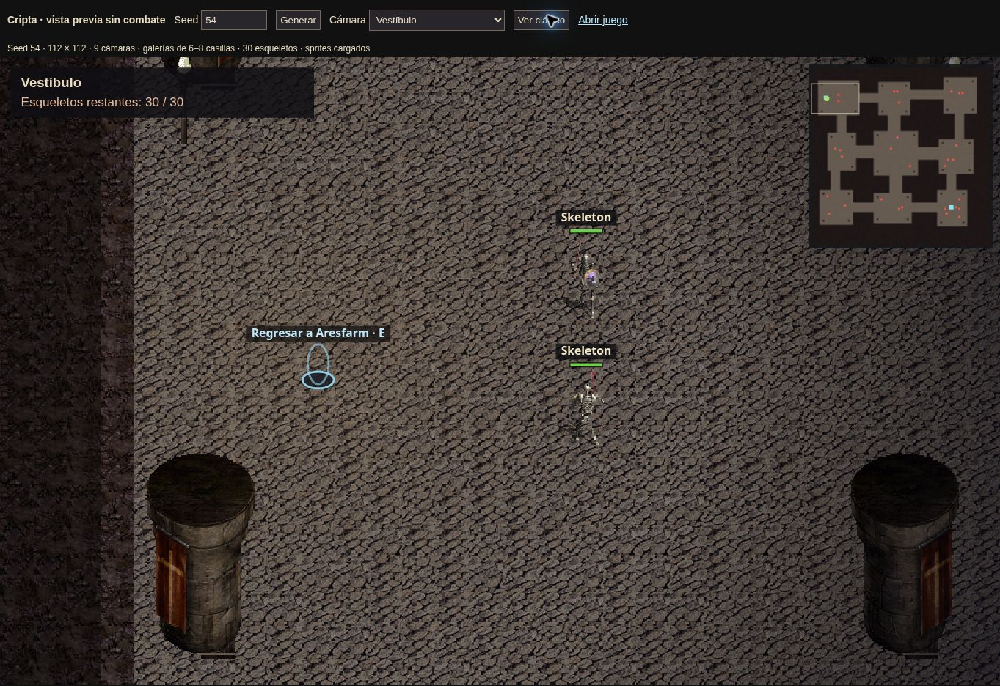

# Cripta — entrega 2

Corrige la primera entrega: el suelo elegía `t330/20`, un fotograma negro, y la entrada vacía con pasillos de dos casillas daba poco espacio para explorar.

- Mapa de 112 × 112, nueve cámaras de 18–28 casillas y doce conexiones que forman circuitos. Galerías de seis casillas y ocho alrededor de la cámara central.
- 29–36 esqueletos por instancia: dos guardianes visibles a ocho casillas del inicio, grupos en las cámaras y seis en el santuario final. Se mantienen las estadísticas, combate y drops originales; no reaparecen.
- Pilares y antorchas de `objects1` (`t200`); los pilares bloquean su casilla y nunca estrechan una galería. El minimapa conserva enemigos y portales.
- Suelos de piedra `t330/1,21,41,61`, paredes rocosas `t301` con bordes iluminados. No se usan los fotogramas negros ni el suelo transparente. Se reutilizan las hojas originales ya convertidas; todavía no es una copia de la geometría ni de la paleta completa de Middle Dungeon.
- Panel de cámara actual y enemigos restantes; el servidor también transmite el contador al matar enemigos fuera de la vista del cliente.
- Piedra oscurecida para distinguir los huesos, cámara limitada a los bordes de la cripta y nombres/barras visibles en remastered.
- JSON revalidado, verificación de datos Skeleton y sus 40 hojas, descargas limitadas a doce simultáneas y un reintento por gráfico. Una imagen rota produce un error visible en lugar de simular una carga correcta. Los bloques pendientes no quedan guardados sin texturas.
- El despliegue añade su SHA a las entradas HTML y a todos los imports ESM mediante `tools/version_web.py`. Así un navegador con caché de la entrega anterior descarga un grafo de módulos consistente. Las fuentes del repositorio y el servidor local mantienen sus rutas habituales.

Referencia de distribución: [`middled1x.amd`](https://github.com/isolatorhk/Helbreath.ServerFiles/blob/master/HGServer/MAPDATA/middled1x.amd) y su configuración: cámaras, galerías, puntos de entrada y distintas zonas de encuentros. El original es de 200 × 200; esta entrega mantiene un recorrido menor.

## Coordinación por Git

Rama `fix/dungeon-exploration-v2`, basada en `fed3a0e`. Ámbito: `shared/dungeon.js`, `shared/adventure.js`, `client/assets.js`, `client/renderer.js`, transmisión del contador en `server/server.mjs` y pruebas. Se conservan la creación de personajes, los controles y la interfaz original del otro agente. Antes de integrar se comparan las nuevas revisiones de main y se incorporan al árbol de entrega, sin reemplazar archivos ajenos con copias antiguas.

## Validación

```sh
node tests/sim.test.mjs
node --test tests/assets.test.mjs tests/dungeon.test.mjs tests/net-dungeon.test.mjs
node tests/net-walk.test.mjs
python tests/version_web_test.py
```

Las pruebas incluyen 1.000 seeds conectadas; ancho libre de todas las galerías; guardianes iniciales visibles; combate, botín, contador, muerte, regreso e instancias separadas; imágenes PNG reales (píxeles de suelo y 160 fotogramas de esqueletos); descarga fallida/reintento y reconstrucción de bloques pendientes.

Para probar: recargar la página y entrar en (134,94) con E cuando el personaje haya terminado de caminar. Comprobar piedra sin cuadros negros, dos guardianes en el vestíbulo, galerías anchas y contador decreciente al combatir. Repetir con gráficos clásicos y remastered.

Vista pública sin combate ni guardado: [`dungeon-preview.html`](https://sans-pablo.github.io/hbweb/dungeon-preview.html). Usa el mismo generador, World, Sprites y Renderer; permite cambiar seed, cámara y modo gráfico. Sirve para comprobar texturas y distribución sin modificar una partida.

## Comprobación visual

Vista publicada validada en clásico y remastered tras desplegar `7b9a4fa`: guardianes visibles, piedra sin cuadros negros, pilares, contador y cámara dentro del mapa. Captura del vestíbulo (seed 54; vista sin combate):


