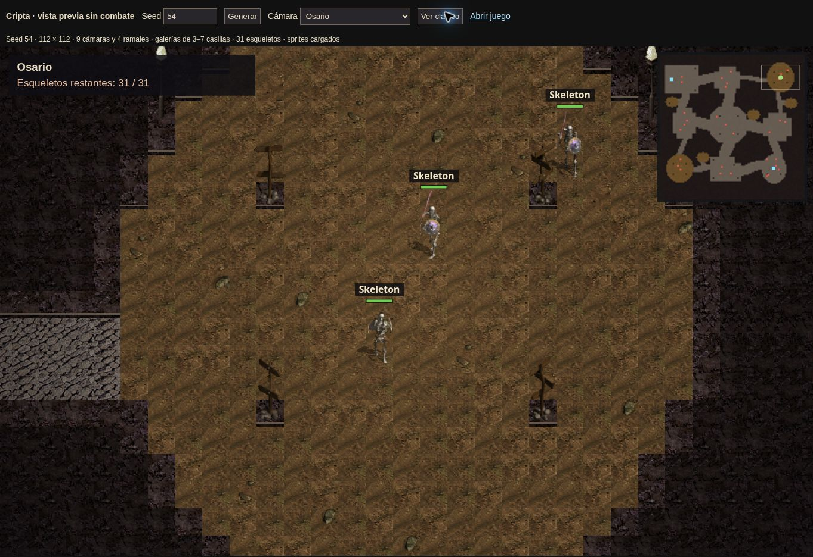

# Verificación visual de la cripta v3

Versión publicada: 89115c95ba2b66524d2f8c6df7d0f07e178add93. CI y Pages aprobados. Vista pública de prueba: https://sans-pablo.github.io/hbweb/dungeon-preview.html, seed 54, cámara Osario, modos clásico y remastered comprobados. Nueve cámaras, cuatro ramales, 31 enemigos, suelos completos sin pasto repetido y sprites originales cargados.

La continuidad y elección de instancia se verificaron con simulación y dos clientes contra servidor real; esta vista pública es una inspección sin combate ni guardado.
